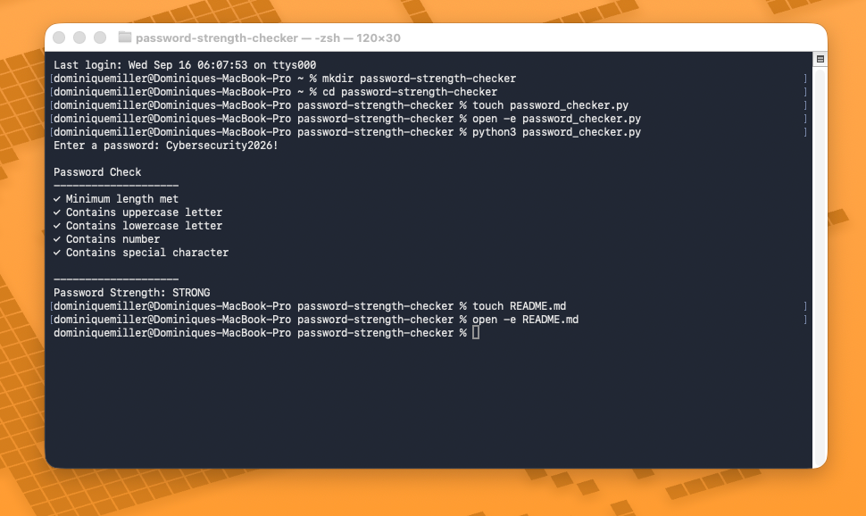

# Password Strength Checker

A simple Python cybersecurity project that evaluates password strength based on common security requirements.

## Features

- Checks minimum password length
- Detects uppercase letters
- Detects lowercase letters
- Detects numbers
- Detects special characters
- Rates passwords as Weak, Medium, or Strong

## Skills Demonstrated

- Python
- Regular Expressions
- Conditional Logic
- Input Validation
- Cybersecurity Fundamentals

## How to Run

```bash
python3 password_checker.py

## Screenshot

